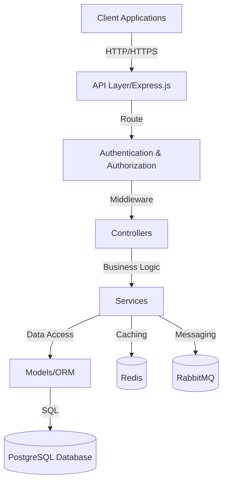
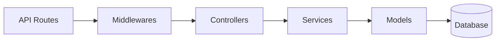
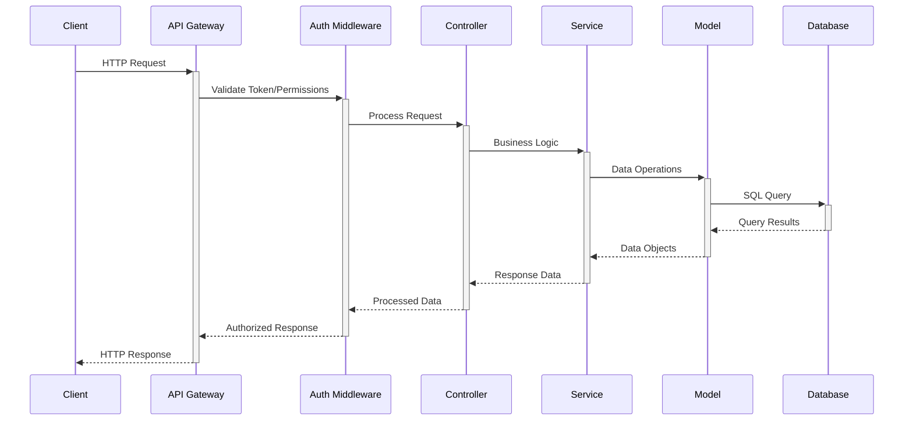
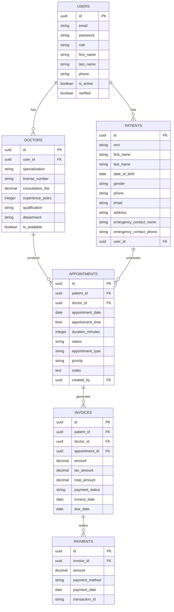
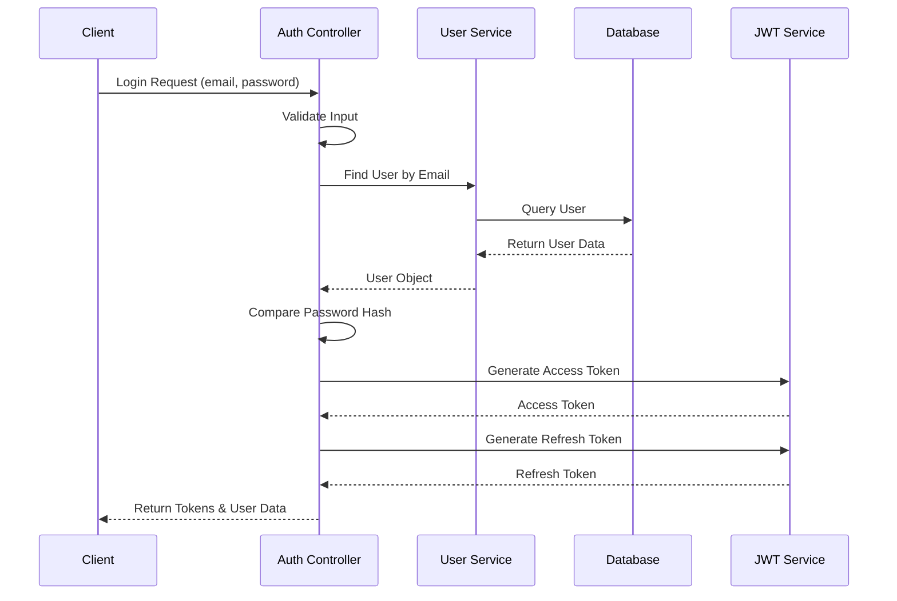
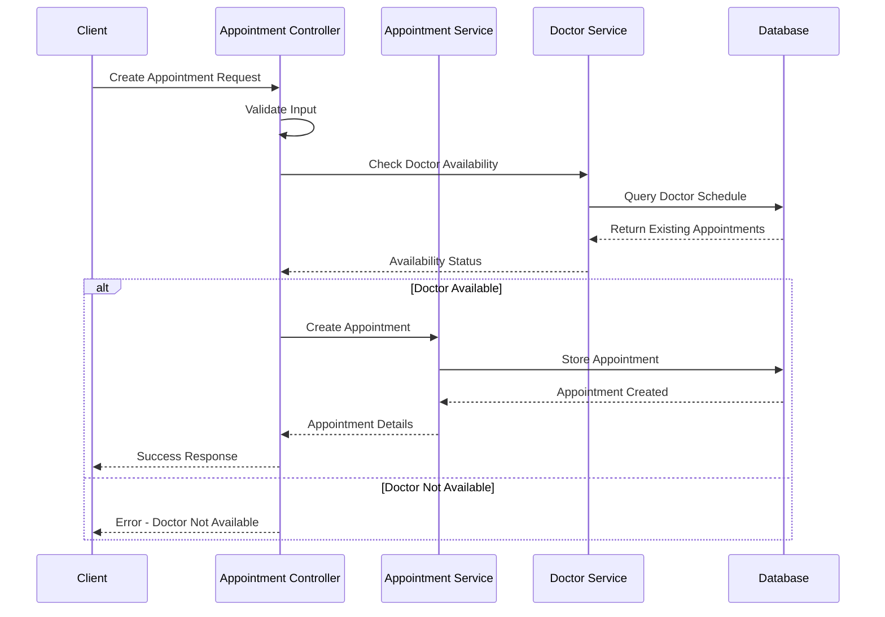
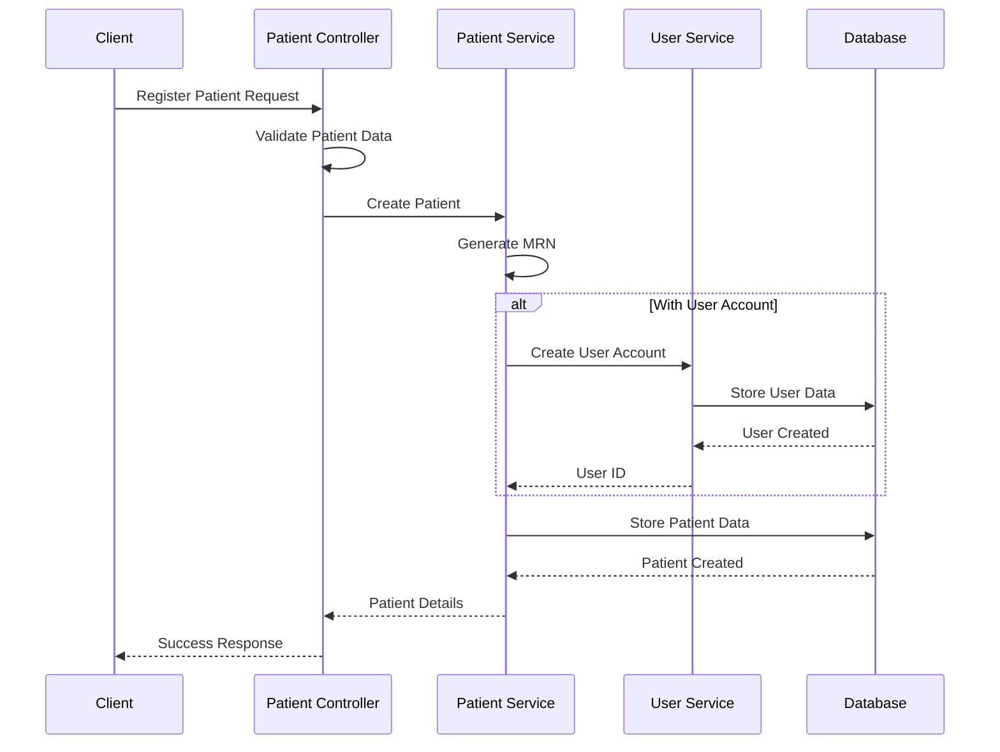
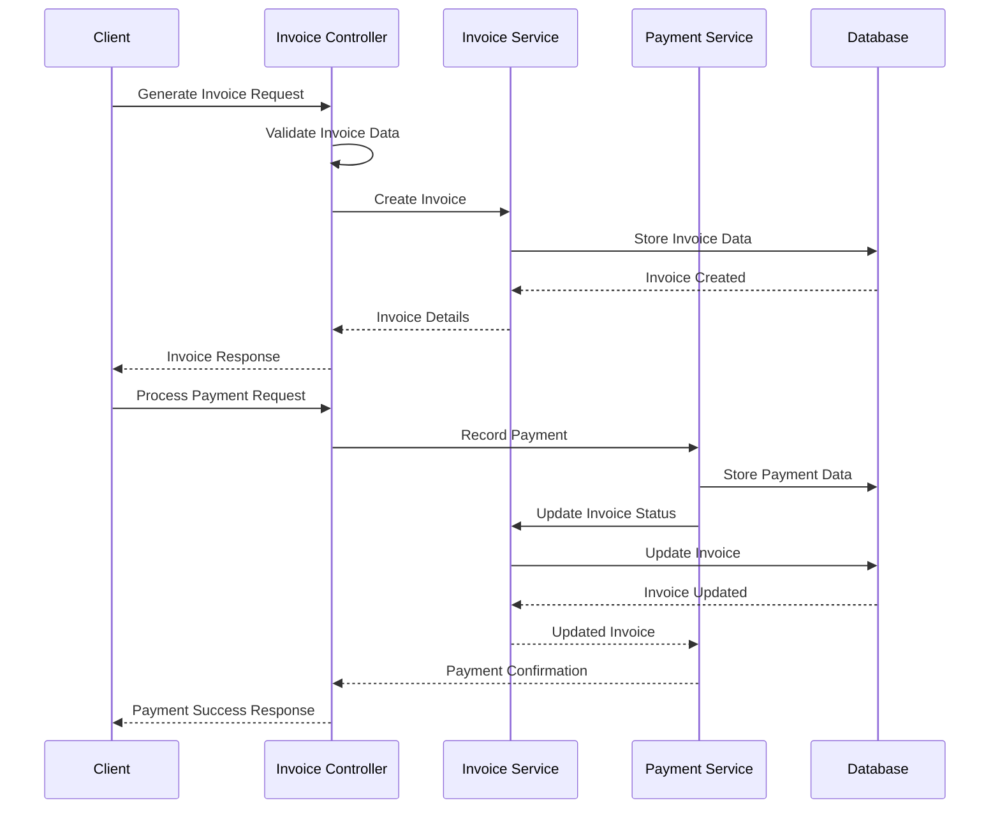

# Hospital Management System Backend Design

## 1. Overview

The Hospital Management System (HMS) is a comprehensive backend application designed to manage healthcare facility operations efficiently. It provides core functionalities for managing patients, doctors, appointments, and billing in a healthcare environment. The system is built using Node.js, TypeScript, Express.js, Sequelize-TypeScript ORM, and PostgreSQL database.

### Business Value

- **Streamlined Operations**: Automates and simplifies daily hospital management tasks
- **Improved Patient Experience**: Enables efficient appointment scheduling and patient management
- **Enhanced Data Security**: Implements secure authentication and authorization mechanisms
- **Financial Management**: Comprehensive billing and invoicing system
- **Data-Driven Insights**: Reporting capabilities for business intelligence

### Key Features

1. User Authentication and Authorization
2. Patient Registration and Management
3. Doctor Management
4. Appointment Scheduling
5. Billing and Invoicing
6. Reporting and Analytics

## 2. Architecture

### High-Level Architecture



### Component Architecture



### Technology Stack

- **Backend Framework**: Express.js 5.1.0
- **Language**: TypeScript
- **ORM**: Sequelize-TypeScript
- **Database**: PostgreSQL
- **Authentication**: JWT (JSON Web Tokens)
- **Password Encryption**: bcryptjs
- **Caching**: Redis
- **Message Queue**: RabbitMQ
- **Validation**: Joi, Express-validator
- **Security**: Helmet, CORS, XSS Protection, Rate limiting

### Data Flow Architecture



## 3. API Endpoints Reference

### Authentication

| Endpoint | Method | Description | Auth Required | Roles |
|----------|--------|-------------|--------------|-------|
| `/api/auth/login` | POST | User login | No | - |
| `/api/auth/logout` | POST | User logout | Yes | Any |
| `/api/auth/refresh-token` | POST | Refresh access token | No | - |
| `/api/auth/forgot-password` | POST | Request password reset | No | - |
| `/api/auth/reset-password` | POST | Reset password | No | - |
| `/api/auth/me` | GET | Get current user | Yes | Any |

**Request Schema (Login):**
```json
{
  "email": "string",
  "password": "string"
}
```

**Response Schema (Login):**
```json
{
  "success": true,
  "message": "Login successful",
  "data": {
    "user": {
      "id": "uuid",
      "first_name": "string",
      "last_name": "string",
      "email": "string",
      "role": "string",
      "phone": "string",
      "verified": boolean,
      "is_active": boolean
    },
    "tokens": {
      "accessToken": "string",
      "refreshToken": "string"
    }
  }
}
```

### User Management

| Endpoint | Method | Description | Auth Required | Roles |
|----------|--------|-------------|--------------|-------|
| `/api/users` | GET | Get all users | Yes | Admin |
| `/api/users` | POST | Create user | Yes | Admin |
| `/api/users/:id` | GET | Get user by ID | Yes | Admin, Self |
| `/api/users/:id` | PUT | Update user | Yes | Admin, Self |
| `/api/users/:id` | DELETE | Deactivate user | Yes | Admin |
| `/api/users/roles` | GET | Get all roles | Yes | Admin |

**Request Schema (Create User):**
```json
{
  "first_name": "string",
  "last_name": "string",
  "email": "string",
  "password": "string",
  "phone": "string (optional)",
  "role": "string (admin, staff, doctor, patient)"
}
```

### Patient Management

| Endpoint | Method | Description | Auth Required | Roles |
|----------|--------|-------------|--------------|-------|
| `/api/patients` | GET | Get all patients | Yes | Admin, Doctor, Staff |
| `/api/patients` | POST | Create patient | Yes | Admin, Staff |
| `/api/patients/:id` | GET | Get patient | Yes | Admin, Doctor, Staff, Self |
| `/api/patients/:id` | PUT | Update patient | Yes | Admin, Staff |
| `/api/patients/:id` | DELETE | Soft delete patient | Yes | Admin |
| `/api/patients/search` | GET | Search patients | Yes | Admin, Doctor, Staff |
| `/api/patients/:id/history` | GET | Get patient history | Yes | Admin, Doctor, Staff, Self |
| `/api/patients/generate-mrn` | POST | Generate MRN | Yes | Admin, Staff |

**Query Parameters for GET /api/patients**
```
page=1              // Page number for pagination
limit=10            // Records per page
search=john         // Search term for name, email, or MRN
sort_by=created_at  // Field to sort by
order=desc          // Sort order (asc/desc)
```

### Doctor Management

| Endpoint | Method | Description | Auth Required | Roles |
|----------|--------|-------------|--------------|-------|
| `/api/doctors` | GET | Get all doctors | Yes | Admin, Staff |
| `/api/doctors` | POST | Create doctor | Yes | Admin |
| `/api/doctors/:id` | GET | Get doctor | Yes | Admin, Staff, Self |
| `/api/doctors/:id` | PUT | Update doctor | Yes | Admin, Self |
| `/api/doctors/:id` | DELETE | Deactivate doctor | Yes | Admin |
| `/api/doctors/specializations` | GET | Get specializations | Yes | Any |
| `/api/doctors/available` | GET | Get available doctors | Yes | Any |

**Request Schema (Create Doctor):**
```json
{
  "user_id": "string (UUID)",
  "specialization": "string",
  "license_number": "string",
  "consultation_fee": "number",
  "experience_years": "number (optional)",
  "qualification": "string (optional)",
  "department": "string (optional)",
  "working_hours_start": "string (optional)",
  "working_hours_end": "string (optional)",
  "working_days": "number[] (optional)",
  "appointment_duration_minutes": "number (optional)",
  "max_appointments_per_day": "number (optional)"
}
```

### Appointment Management

| Endpoint | Method | Description | Auth Required | Roles |
|----------|--------|-------------|--------------|-------|
| `/api/appointments` | GET | Get all appointments | Yes | Admin, Doctor, Staff |
| `/api/appointments` | POST | Create appointment | Yes | Admin, Staff, Patient |
| `/api/appointments/:id` | GET | Get appointment | Yes | Admin, Doctor, Staff, Owner |
| `/api/appointments/:id` | PUT | Update appointment | Yes | Admin, Doctor, Staff |
| `/api/appointments/:id` | DELETE | Cancel appointment | Yes | Admin, Staff, Owner |
| `/api/appointments/calendar` | GET | Calendar view | Yes | Admin, Doctor, Staff |
| `/api/appointments/check-availability` | POST | Check availability | Yes | Any |
| `/api/appointments/patient/:patient_id` | GET | Patient appointments | Yes | Admin, Doctor, Staff, Owner |
| `/api/appointments/doctor/:doctor_id` | GET | Doctor appointments | Yes | Admin, Staff, Owner |

**Request Schema (Create Appointment):**
```json
{
  "patient_id": "string (UUID)",
  "doctor_id": "string (UUID)",
  "appointment_date": "string (YYYY-MM-DD)",
  "appointment_time": "string (HH:MM)",
  "duration_minutes": "number (optional)",
  "appointment_type": "string (optional)",
  "priority": "string (optional)",
  "notes": "string (optional)",
  "chief_complaint": "string (optional)"
}
```

### Invoice Management

| Endpoint | Method | Description | Auth Required | Roles |
|----------|--------|-------------|--------------|-------|
| `/api/invoices` | GET | Get all invoices | Yes | Admin, Staff |
| `/api/invoices` | POST | Create invoice | Yes | Admin, Staff |
| `/api/invoices/:id` | GET | Get invoice | Yes | Admin, Staff, Owner |
| `/api/invoices/:id` | PUT | Update invoice | Yes | Admin, Staff |
| `/api/invoices/:id` | DELETE | Cancel invoice | Yes | Admin |
| `/api/invoices/patient/:patient_id` | GET | Patient invoices | Yes | Admin, Staff, Owner |
| `/api/invoices/:id/send` | POST | Email invoice | Yes | Admin, Staff |

**Request Schema (Create Invoice):**
```json
{
  "patient_id": "string (UUID)",
  "doctor_id": "string (UUID)",
  "appointment_id": "string (UUID, optional)",
  "invoice_type": "string (optional)",
  "description": "string (optional)",
  "subtotal": "number",
  "tax_rate": "number (optional)",
  "discount_amount": "number (optional)",
  "due_date": "string (optional)",
  "line_items": [
    {
      "description": "string",
      "quantity": "number",
      "unit_price": "number"
    }
  ],
  "notes": "string (optional)"
}
```

### Payment Management

| Endpoint | Method | Description | Auth Required | Roles |
|----------|--------|-------------|--------------|-------|
| `/api/payments` | GET | Get all payments | Yes | Admin, Staff |
| `/api/payments` | POST | Record payment | Yes | Admin, Staff |
| `/api/payments/:id` | GET | Get payment | Yes | Admin, Staff, Owner |
| `/api/payments/invoice/:invoice_id` | GET | Invoice payments | Yes | Admin, Staff, Owner |
| `/api/payments/partial` | POST | Partial payment | Yes | Admin, Staff |

**Request Schema (Record Payment):**
```json
{
  "invoice_id": "string (UUID)",
  "amount": "number",
  "payment_method": "string",
  "payment_date": "string (YYYY-MM-DD)",
  "transaction_id": "string (optional)",
  "notes": "string (optional)"
}
```

### Reporting

| Endpoint | Method | Description | Auth Required | Roles |
|----------|--------|-------------|--------------|-------|
| `/api/reports/appointments` | GET | Appointment reports | Yes | Admin, Staff |
| `/api/reports/revenue` | GET | Revenue reports | Yes | Admin |
| `/api/reports/patients` | GET | Patient reports | Yes | Admin, Staff |
| `/api/reports/doctors` | GET | Doctor utilization | Yes | Admin |
| `/api/reports/dashboard` | GET | Dashboard data | Yes | Admin, Staff, Doctor |

**Query Parameters for Reports**
```
start_date=2024-01-01
end_date=2024-01-31
doctor_id=123
format=json
```

## 4. Data Models & ORM Mapping

### Entity Relationship Diagram



### Key Model Classes

#### User Model

```typescript
@Table({
  tableName: 'users',
  timestamps: true,
  paranoid: true
})
export class User extends Model {
  @Column({
    type: DataType.UUID,
    defaultValue: DataType.UUIDV4,
    primaryKey: true
  })
  id!: string;

  @Column({
    type: DataType.STRING,
    allowNull: false
  })
  first_name!: string;

  @Column({
    type: DataType.STRING,
    allowNull: false
  })
  last_name!: string;

  @Column({
    type: DataType.STRING,
    unique: true,
    allowNull: false
  })
  email!: string;

  @Column({
    type: DataType.STRING,
    allowNull: false
  })
  password!: string;

  @Column({
    type: DataType.ENUM('admin', 'staff', 'doctor', 'patient'),
    defaultValue: 'patient'
  })
  role!: string;

  @Column({
    type: DataType.BOOLEAN,
    defaultValue: true
  })
  is_active!: boolean;
}
```

#### Patient Model

```typescript
@Table({
  tableName: 'patients',
  timestamps: true,
  paranoid: true
})
export class Patient extends Model {
  @Column({
    type: DataType.UUID,
    defaultValue: DataType.UUIDV4,
    primaryKey: true
  })
  id!: string;

  @Column({
    type: DataType.STRING,
    unique: true,
    allowNull: false
  })
  mrn!: string;

  @Column({
    type: DataType.STRING,
    allowNull: false
  })
  first_name!: string;

  @Column({
    type: DataType.STRING,
    allowNull: false
  })
  last_name!: string;

  @Column({
    type: DataType.DATEONLY,
    allowNull: false
  })
  date_of_birth!: Date;

  @ForeignKey(() => User)
  @Column(DataType.UUID)
  user_id?: string;

  @BelongsTo(() => User)
  user?: User;
}
```

## 5. Business Logic Layer

### Authentication Flow



### Appointment Scheduling Flow



### Patient Registration Flow



### Billing and Payment Flow



## 6. Middleware & Interceptors

### Authentication Middleware

The system uses JWT-based authentication to protect API endpoints. This middleware verifies the token and extracts user information:

```typescript
const authentication = (req: ExpressRequest, res: Response, next: NextFunction) => {
  // Extract token from Authorization header
  let token = req.headers.authorization?.split(' ')[1];
  if (!token) {
    return res.status(401).json({ message: 'No token provided' });
  }

  try {
    // Verify and decode JWT
    const decoded = jwt.verify(token, process.env.JWT_SECRET) as JwtPayload;
    if (!decoded) {
      return res.status(401).json({ message: 'Unauthorized' });
    }
    
    // Attach user info to request object
    req.user = decoded;
    next();
  } catch (error) {
    console.error('Authentication error:', error);
    res.status(401).send({ error: 'Please authenticate.' });
  }
};
```

### Authorization Middleware

Role-based authorization is implemented to control access to resources:

```typescript
export const checkRole = (roles: string[]) => {
  return (req: Request, res: Response, next: NextFunction): void => {
    if (!req.user) {
      return res.status(401).json({
        status: 'error',
        message: 'Unauthorized - No user found in request'
      });
    }
    
    const userRole = req.user.role;
    
    if (!roles.includes(userRole)) {
      return res.status(403).json({
        status: 'error',
        message: 'Access denied - insufficient permission'
      });
    }
    
    next();
  };
};
```

### Error Handling Middleware

A centralized error handler that manages different types of errors and provides consistent responses:

```typescript
export const errorHandler = (
  err: any,
  req: Request,
  res: Response,
  next: NextFunction
) => {
  const status = err.status || 500;
  const message = err.message || 'Something went wrong';

  // Log detailed error information
  console.error(`[ERROR] ${status} - ${message}`);
  if (err.stack) console.error(err.stack);

  // Send appropriate response based on error type
  if (err.name === 'ValidationError') {
    return res.status(400).json({
      success: false,
      message: 'Validation Error',
      errors: err.details || [message]
    });
  }

  // Handle Sequelize-specific errors
  if (err.name === 'SequelizeValidationError') {
    const validationErrors = err.errors.map((e: any) => e.message);
    return res.status(400).json({
      success: false,
      message: 'Database Validation Error',
      errors: validationErrors
    });
  }

  // Default error response
  res.status(status).json({
    success: false,
    message,
    stack: process.env.NODE_ENV === 'development' ? err.stack : undefined
  });
};
```

### Request Validation Middleware

Input validation middleware using Joi or Express-validator:

```typescript
export const validateRequest = (schema: any) => {
  return (req: Request, res: Response, next: NextFunction) => {
    const { error } = schema.validate(req.body);
    
    if (error) {
      const errors = error.details.map((detail: any) => detail.message);
      return res.status(400).json({
        success: false,
        message: 'Validation Error',
        errors
      });
    }
    
    next();
  };
};
```

### Security Middleware Stack

```typescript
// Apply security middlewares
app.use(helmet()); // Sets various HTTP headers for security
app.use(cors(corsOptions)); // CORS protection
app.use(mongoSanitize()); // Prevents MongoDB injection
app.use(xss()); // Prevents XSS attacks
app.use(compression()); // Compresses responses
app.use(morgan('combined')); // Logging
app.use(express.json({ limit: '10kb' })); // Body parsing with size limit
```

## 7. Testing

### Testing Strategy

The system employs a comprehensive testing strategy:

1. **Unit Tests**: For individual components and functions
2. **Integration Tests**: For API endpoints and service interactions
3. **End-to-End Tests**: For complete user flows
4. **Security Tests**: For authentication and authorization

### Test Framework

- Jest: Test runner and assertion library
- SuperTest: HTTP testing

### Sample Test Cases

#### Unit Test - User Service

```typescript
describe('UserService', () => {
  it('should hash password when creating a new user', async () => {
    // Arrange
    const userData = {
      first_name: 'Test',
      last_name: 'User',
      email: 'test@example.com',
      password: 'Password123!'
    };
    
    // Act
    const user = await UserService.createUser(userData);
    
    // Assert
    expect(user).toBeDefined();
    expect(user.password).not.toBe('Password123!');
    expect(bcrypt.compareSync('Password123!', user.password)).toBe(true);
  });
});
```

#### Integration Test - Authentication API

```typescript
describe('Authentication API', () => {
  it('should login a user with valid credentials', async () => {
    // Arrange - Create a test user
    await UserService.createUser({
      first_name: 'Test',
      last_name: 'User',
      email: 'test@example.com',
      password: 'Password123!'
    });
    
    // Act
    const response = await request(app)
      .post('/api/auth/login')
      .send({
        email: 'test@example.com',
        password: 'Password123!'
      });
    
    // Assert
    expect(response.status).toBe(200);
    expect(response.body.success).toBe(true);
    expect(response.body.data.tokens.accessToken).toBeDefined();
    expect(response.body.data.user.email).toBe('test@example.com');
  });
});
```

### Test Data Management

- Factory patterns to generate test data
- Database seeding for integration tests
- Environment-specific test configurations

### Continuous Integration

- Automated testing in CI/CD pipeline
- Test coverage reporting
- Pre-commit hooks for code quality checks
