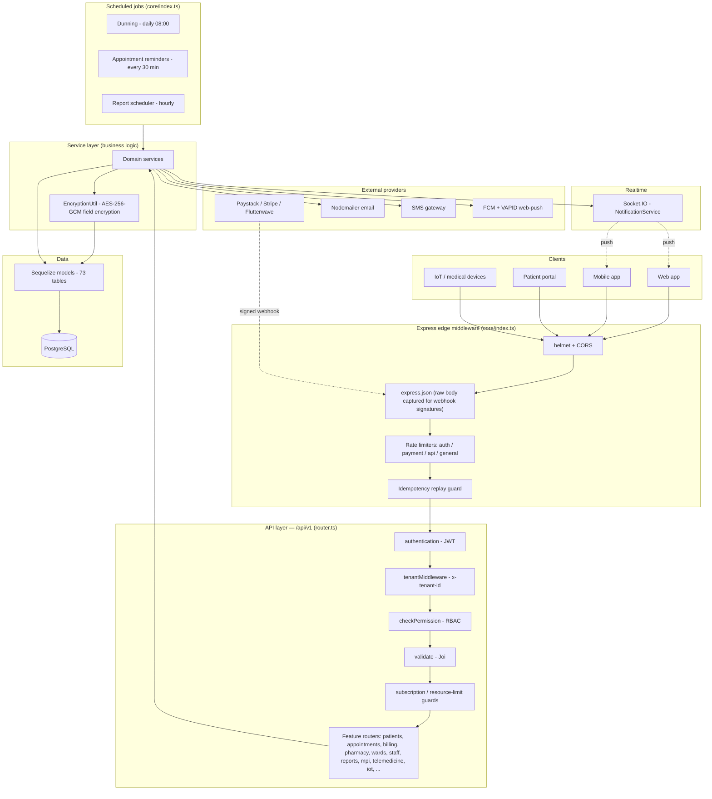

# System Architecture

Multi-tenant hospital-management backend — Node.js / Express / TypeScript / Sequelize / PostgreSQL. Each **Tenant** is a hospital/clinic; almost every table is tenant-scoped. Diagrams are [Mermaid](https://mermaid.js.org) and render on GitHub.

## Runtime architecture

## Layer responsibilities

| Layer | Responsibility | Key files |
|---|---|---|
| Edge | TLS headers, CORS, rate limiting, raw-body capture (webhook signatures), idempotency | `src/core/index.ts`, `src/middlewares/rate-limiter.middleware.ts`, `idempotency.middleware.ts` |
| Auth | JWT verification, attaches `req.user` | `src/middlewares/authentication.ts` |
| Tenant | Resolves `req.tenant` from `x-tenant-id`; **rejects requests with no tenant (400)** | `src/middlewares/tenant.middleware.ts` |
| RBAC | Role→permission gate per route | `src/middlewares/permission.middleware.ts`, `src/config/rbac.config.ts` |
| Validation | Joi schemas per endpoint | `src/utils/validators/*` |
| Services | Business logic, transactions, tenant scoping | `src/modules/**/**.service.ts` |
| Encryption | Transparent AES-256-GCM getters/setters on sensitive PII/medical columns | `src/utils/encryption.util.ts` |
| Data | Sequelize models → Postgres (paranoid soft-delete, `underscored`) | `src/modules/**/**.model.ts`, `src/models/index.ts` |

## Cross-cutting concerns

- **Multi-tenancy** — `tenant_id` on nearly every table; services filter by it. The tenant is the hospital.
- **MPI / global identity** — a global `Person` sits above tenant-scoped `Patient` rows (`patient.person_id`) so one human is recognizable across hospitals. Cross-tenant clinical reads are consent-gated (planned Phase 2), never implicit.
- **Encryption at rest** — medical/sensitive fields (diagnosis, notes, patient contact PII) are encrypted; basic identifiers stay plaintext for search.
- **Audit** — `audit_logs` records privileged actions; compliance module adds consent + NDPR/GDPR data-subject requests.
