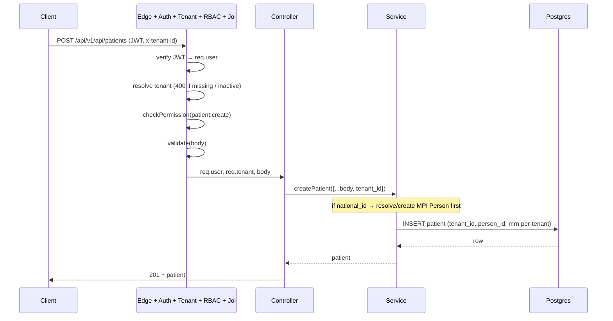
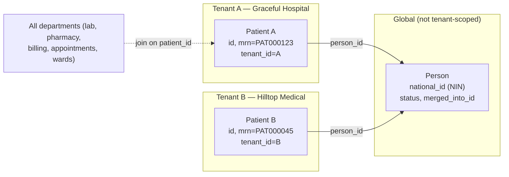
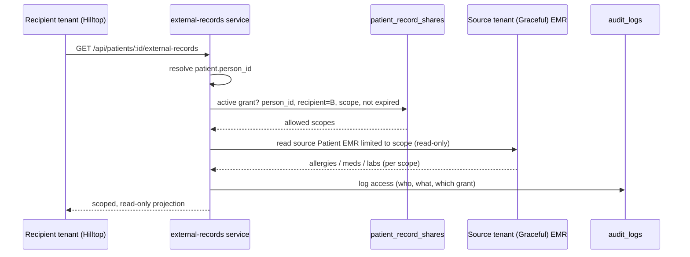

# Database Data Flow

How a request travels through the layers and where **tenant isolation** and **global identity (MPI)** apply.

## 1. Standard tenant-scoped write (e.g. create a patient)

Every domain read/write carries `tenant_id`; a query without it is a cross-tenant leak. Reads scope with `where: { tenant_id }`; the `(tenant_id, mrn)` unique index keeps MRNs hospital-local.

## 2. Cross-hospital identity (MPI)

The same human at two hospitals is two tenant-scoped `Patient` rows linked to one global `Person`.

- Linking is **deterministic on exact NIN match** at create, or a manual tenant-checked `POST /api/patients/:id/link-person`. No fuzzy auto-merge.
- Departments always join on the tenant-local `patient_id` — MPI adds identity, it does not change intra-hospital joins.

## 3. Consent-gated cross-tenant read (planned — MPI Phase 2)

This is the **only** sanctioned cross-tenant data path — dashed today, to be built in Phase 2. A companion hardening PR closes the remaining accidental cross-tenant `Patient.findByPk` lookups so nothing reads across tenants except through this gate.
