# Database Schema (ERD)

73 tables, grouped by domain. Nearly every table has `tenant_id` → **tenants** (omitted from per-domain diagrams to reduce noise; shown in the hub map). PK is `id` (UUID) everywhere; `created_at`/`updated_at`/`deleted_at` (paranoid soft-delete) are omitted. Derived from `src/modules/**/**.model.ts`.

## Top-level hub map

Everything hangs off four hubs: **tenants** (the hospital), **users** (accounts), **patients** (tenant-scoped clinical record), and **persons** (global cross-tenant identity).

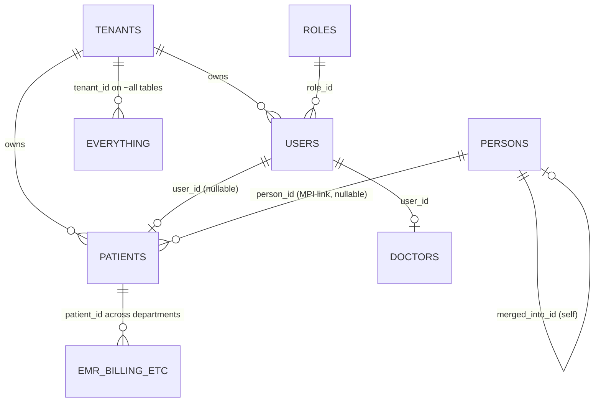

## 1. Identity & Tenancy

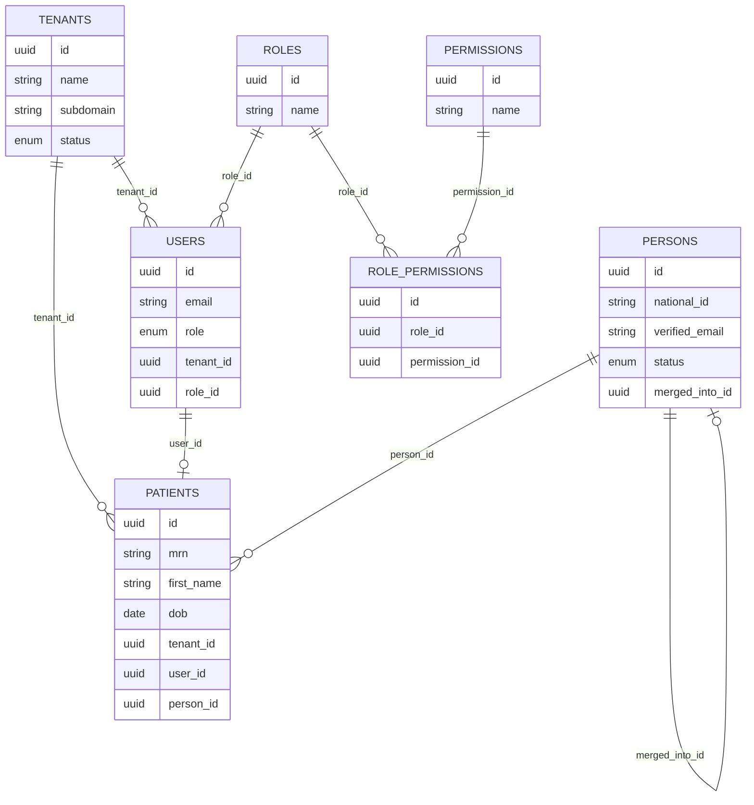

`mrn` is unique per `(tenant_id, mrn)`. `persons` is the only non-tenant-scoped table.

## 2. Clinical / EMR

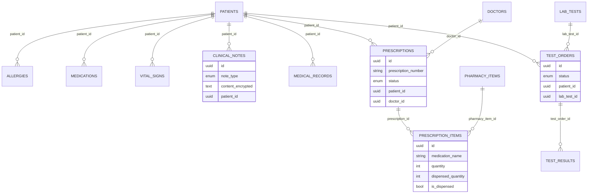

Encrypted columns (AES-256-GCM): clinical note content/diagnosis, prescription text, appointment diagnosis/treatment, patient contact PII.

## 3. Appointments / Scheduling / Queue / Triage

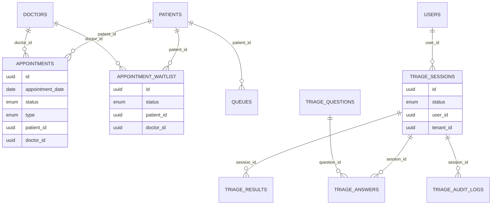

Triage runs with only `authentication` (no `tenantMiddleware`) — usable without a hospital context.

## 4. Billing / Insurance

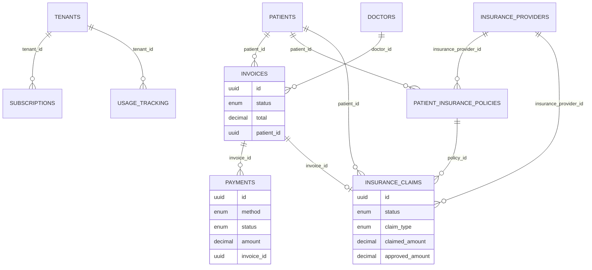

## 5. Pharmacy / Supplies / Inventory

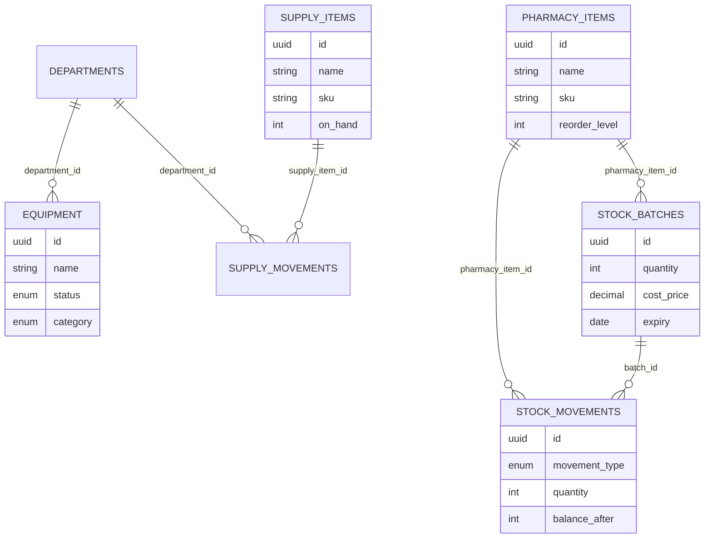

## 6. Wards / Beds / Admissions

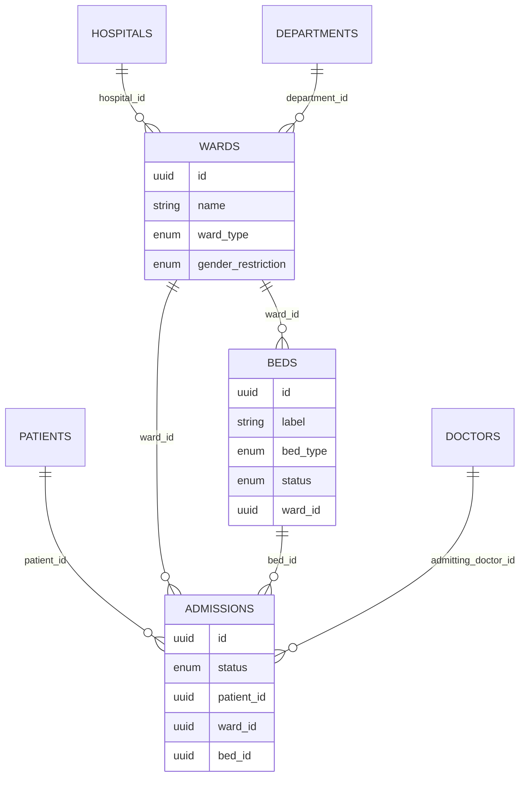

## 7. Staff / HR

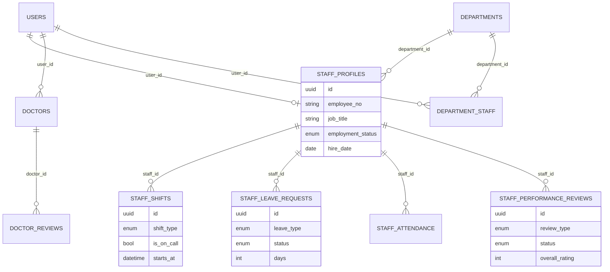

## 8. IoT / Telemedicine

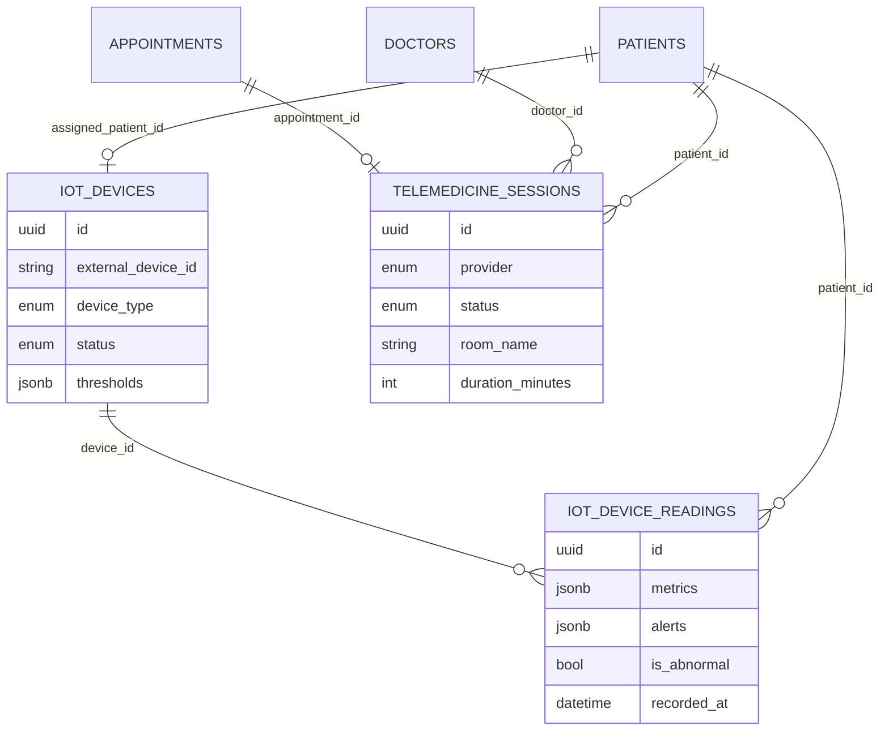

## 9. Reports / Audit / Compliance

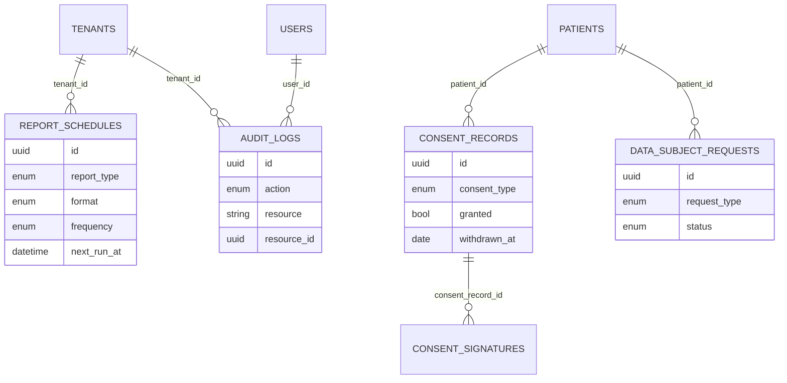

## 10. Notifications / Files / System

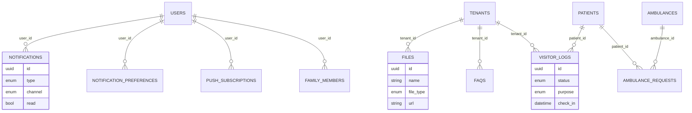

## Planned (MPI Phase 2)

Not yet in the DB — shown so the direction is visible:

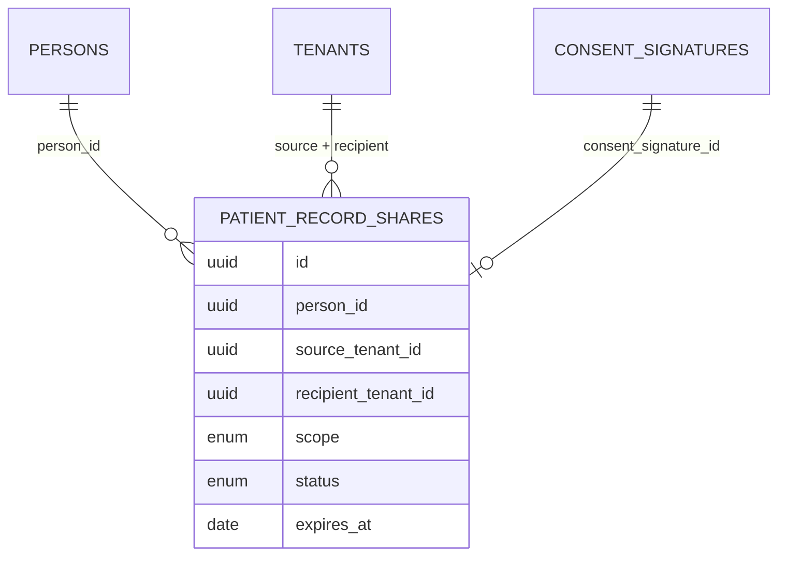
